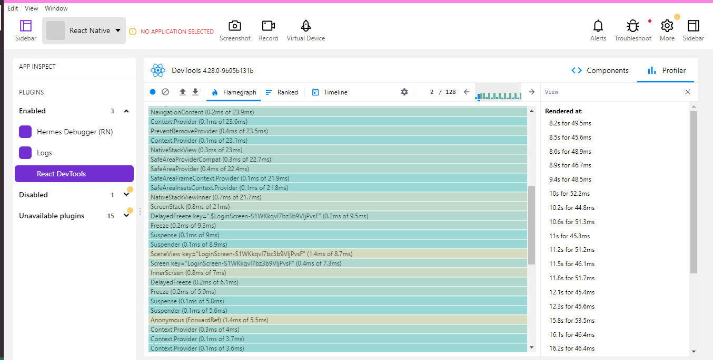

# Recipe Social Media App

Welcome to the Recipe Social Media App - the perfect place to explore, share, and cherish the joy of cooking!

## Features

- **User Authentication**: Secure login and signup with email and password, powered by Firebase Authentication and Redux for state management. Features include:
  - Email validation
  - Strong password enforcement
  - Password recovery
  - Remember-me functionality
- **Recipe Browsing**: A delightful browsing experience with a wide range of recipes, complete with images and cooking times.

- **Ingredients Detail**: Dive deeper into the cooking process with a detailed list of ingredients for each recipe.

- **Favorites**: Show some love for your favorite recipes with our heart icon, which triggers a local notification.

- **User Profile**: Personalize your journey with a dedicated profile section, accessible via a drawer navigation interface.

- **Add New Recipes**: Contribute to the community by posting new recipes with images and details right from your device.

- **Help Center**: A dedicated space for assistance, equipped with contact information for support.

- **Deep Linking Support**: Direct access to login or signup screens with deep linking commands.

- **Platform-Specific Alerts**: Customized alert displays for Android and iOS users.

Based on the information you've provided, here is a draft of the README for your Recipe Social Media App project.

markdown
Copy code

# Recipe Social Media App

Welcome to the Recipe Social Media App - the perfect place to explore, share, and cherish the joy of cooking! Our platform provides a unique and engaging way to discover new recipes, connect with fellow food enthusiasts, and unleash your culinary creativity.

## Features

- **User Authentication**: Secure login and signup with email and password, powered by Firebase Authentication and Redux for state management. Features include:

  - Email validation
  - Strong password enforcement
  - Password recovery
  - Remember-me functionality

- **Recipe Browsing**: A delightful browsing experience with a wide range of recipes, complete with images and cooking times.

- **Ingredients Detail**: Dive deeper into the cooking process with a detailed list of ingredients for each recipe.

- **Favorites**: Show some love for your favorite recipes with our heart icon, which triggers a local notification.

- **User Profile**: Personalize your journey with a dedicated profile section, accessible via a drawer navigation interface.

- **Add New Recipes**: Contribute to the community by posting new recipes with images and details right from your device.

- **Help Center**: A dedicated space for assistance, equipped with contact information for support.

- **Deep Linking Support**: Direct access to login or signup screens with deep linking commands.

- **Platform-Specific Alerts**: Customized alert displays for Android and iOS users.

## Profiling

Performance is key, which is why we've used Flipper for profiling to ensure a smooth and responsive user experience. __

## Technical Details

- Built with React Native CLI for cross-platform compatibility.
- Robust state management using Redux.
- Dynamic navigation patterns utilizing React Navigation.
- Platform-specific code optimizations for Android and iOS.
- Integration of local notifications for a more interactive UX.
- Deep linking capabilities for streamlined user flows.

## Getting Started

To get started with the Recipe Social Media App:

1. Clone the repository to your local machine.
2. Install dependencies with `npm install`.
3. Start the app with `npx react-native run-android` or `npx react-native run-ios` depending on your target platform.

For deep linking:

- Run `npx uri-scheme open "mychat://app/Login"` to open the login screen.
- Replace `Login` with `SignUp` to access the signup screen directly.
